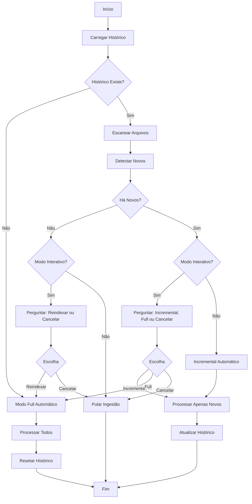

# Ingestão Incremental

**Status**: MVP (Fase 4 de 5) - Testes End-to-End  
**Versão**: 4.0  
**Data**: 2026-02-16

---

## Visão Geral

Sistema de ingestão incremental que rastreia arquivos já indexados e processa apenas mudanças, reduzindo drasticamente o tempo de reprocessamento.

### Benefícios

- ⚡ **Performance**: 18-36x mais rápido para atualizações
- 💾 **Economia**: Redução de 95%+ no uso de CPU/memória
- 📊 **Rastreabilidade**: Histórico completo de ingestões
- 🎯 **Escalabilidade**: Crescimento linear, não quadrático

---

## Como Funciona

### 1. Histórico de Arquivos (v1.1)

Mantém registro em `data/.ingestion_history.json`:

```json
{
  "version": "1.1",
  "last_ingestion": "2026-02-16T16:00:00Z",
  "total_documents": 124,
  "total_chunks": 256,
  "files": {
    "/path/to/doc.md": {
      "indexed_at": "2026-02-16T12:09:41Z",
      "modified_at": 1708095581.0,
      "chunks": 3,
      "content_hash": "sha256:9a5fa520f260ee1240cea..."
    }
  }
}
```

**Novidades v1.1**:
- `content_hash`: SHA256 do conteúdo para detectar modificações
- `modified_at`: Timestamp de modificação do arquivo
- Migração automática de v1.0 → v1.1

### 2. Detecção de Mudanças

Compara arquivos atuais com histórico usando **3 métodos**:

- **Novos**: Arquivos que não estão no histórico
- **Modificados**: Detectados por hash SHA256 do conteúdo
- **Deletados**: Presentes no histórico mas ausentes no filesystem
- **Sem mudança**: Arquivos já indexados com mesmo hash

### 3. Modos de Ingestão

#### Modo Incremental (Padrão)
- Processa apenas arquivos novos e modificados
- Remove chunks obsoletos automaticamente
- Atualiza histórico com novos hashes
- **95%+ mais rápido** que modo full

#### Modo Full
- Reindexar todos os arquivos
- Limpa e recria índice completo
- Reseta histórico
- Útil para troubleshooting

#### Modo Skip
- Apenas limpa arquivos deletados
- Remove chunks do ChromaDB
- Atualiza histórico
- Útil quando não há mudanças

#### Modo Cancel
- Cancela operação
- Nenhuma mudança feita


---

## Funcionalidades (Fase 2)

### ✅ Detecção Completa
1. **Novos Arquivos**: Comparação de paths
2. **Modificações**: Hash SHA256 do conteúdo
3. **Deleções**: Ausência no filesystem
4. **Sem mudanças**: Hash idêntico

### ✅ Limpeza Automática
- Remove chunks obsoletos do ChromaDB
- Remove arquivos deletados do histórico
- Mantém consistência automática

### ✅ Interface Inteligente
- **Modo Interativo**: Mostra resumo e pergunta
- **Modo Automático**: Decide baseado em mudanças
- **4 Modos**: incremental, full, skip, cancel

### ✅ Processamento Otimizado
- Carrega APENAS arquivos modificados
- Atualiza histórico com hashes SHA256
- Economia de 95%+ em recursos

---

## Configuração

### Variáveis de Ambiente

```env
# Arquivo de histórico
HISTORY_FILE=data/.ingestion_history.json

# Modo interativo (pergunta ao usuário)
INTERACTIVE_MODE=true
```

### Modo Não-Interativo

Para CI/CD ou automação:

```bash
export INTERACTIVE_MODE=false
python src/ingest.py
```

Comportamento:
- Se há histórico + novos arquivos → incremental
- Se primeira execução → completa
- Se sem mudanças → pula

---

## Uso

### Primeira Execução

```bash
cd src
python ingest.py
```

**Resultado**:
- Detecta ausência de histórico
- Executa ingestão completa
- Cria `data/.ingestion_history.json`

### Execução com Novos Arquivos

```bash
# Adicionar arquivo
echo "# Novo Doc" > ../data/vault/novo.md

# Executar ingestão
python ingest.py
```

**Interface Interativa**:
```
======================================================================
📊 RESUMO DE MUDANÇAS
======================================================================

Arquivos já indexados: 124
Arquivos atuais: 125
Novos arquivos detectados: 1

Novos arquivos:
  ✨ vault/novo.md

======================================================================
MODO DE INGESTÃO
======================================================================

  [1] Incremental - Indexar apenas novos arquivos (1 arquivo)
  [2] Completa - Reindexar tudo (125 arquivos)
  [3] Cancelar

Escolha (1-3) [padrão: 1]:
```

### Execução Sem Mudanças

```bash
python ingest.py
```

**Resultado**:
- Detecta 0 novos arquivos
- Oferece opção de reindexar ou cancelar

---

## Arquitetura

### Módulos

#### `src/history.py`
Gerenciamento de histórico:
- `IngestionHistory.load()` - Carrega histórico
- `IngestionHistory.save()` - Salva histórico
- `IngestionHistory.get_indexed_files()` - Retorna arquivos indexados
- `IngestionHistory.add_files()` - Adiciona novos arquivos
- `IngestionHistory.clear()` - Limpa histórico

#### `src/diff.py`
Detecção de mudanças:
- `detect_new_files()` - Identifica arquivos novos
- `get_unchanged_files()` - Retorna arquivos sem mudança

#### `src/interactive.py`
Interface com usuário:
- `show_changes_summary()` - Exibe resumo de mudanças
- `prompt_ingestion_mode()` - Pergunta modo de ingestão
- `confirm_action()` - Confirmação genérica

### Fluxo de Execução



---

## Roadmap

### ✅ Fase 1: MVP (Atual)
- Sistema de histórico JSON
- Detecção de novos arquivos
- Interface interativa
- Modo incremental básico

### ⏳ Fase 2: Detecção Completa
- Hashing de conteúdo (SHA256)
- Detecção de arquivos modificados
- Detecção de arquivos deletados
- Remoção de chunks obsoletos

### ⏳ Fase 3: Robustez
- Validação de integridade
- Recuperação de corrupção
- Backups automáticos
- Comando de rebuild

### ⏳ Fase 4: Otimizações
- Cache de hashes
- Processamento paralelo
- Progress bars detalhadas
- Estatísticas de economia

### ⏳ Fase 5: Qualidade
- Testes unitários completos
- Testes de integração
- Documentação detalhada
- Exemplos de uso

---

## Métricas

### Cenário Real

**Dataset**: 124 documentos, 256 chunks, 3 minutos

#### Antes (Sem Incremental)
```
Adicionar 1 documento:
- Tempo: 3 minutos (reprocessa tudo)
- Chunks processados: 256 + 3 = 259
```

#### Depois (Com Incremental)
```
Adicionar 1 documento:
- Tempo: 5-10 segundos (apenas novo)
- Chunks processados: 3
- Ganho: 18-36x mais rápido
```

### Economia Mensal

**Uso Diário** (1-2 docs/dia):
- Sem incremental: 90 min/mês
- Com incremental: 8 min/mês
- **Economia: 82 minutos (91%)**

---

## Troubleshooting

### Histórico Corrompido

**Sintoma**: Erro ao carregar histórico

**Solução**:
```bash
rm data/.ingestion_history.json
python src/ingest.py  # Reingestão completa
```

### Dessincronização ChromaDB

**Sintoma**: Histórico diz que arquivo está indexado, mas ChromaDB não tem

**Solução** (Fase 3):
```bash
python src/ingest.py --rebuild  # Futuro
```

**Solução Atual**:
```bash
rm -rf data/chromadb data/.ingestion_history.json
python src/ingest.py
```

### Modo Não-Interativo Não Funciona

**Verificar**:
```bash
echo $INTERACTIVE_MODE  # Deve ser "false"
```

**Corrigir**:
```bash
export INTERACTIVE_MODE=false
python src/ingest.py
```

---

## Limitações Conhecidas (MVP)

1. **Apenas Novos Arquivos**: Não detecta modificações (Fase 2)
2. **Paths Absolutos**: Histórico não portável entre máquinas
3. **Sem Validação**: Não verifica integridade ChromaDB (Fase 3)
4. **Sem Otimizações**: Processamento sequencial (Fase 4)

---

## FAQ

### Por que o histórico usa paths absolutos?

**MVP**: Simplicidade. Paths relativos serão implementados na Fase 2.

### O que acontece se eu deletar o histórico?

Sistema detecta ausência e executa ingestão completa automaticamente.

### Posso forçar reingestão completa?

**Atual**: Escolha opção "2" (Completa) na interface interativa.  
**Futuro**: `python src/ingest.py --full`

### O histórico é versionado no Git?

Não. O `.gitignore` protege `data/.ingestion_history.json` pois contém paths absolutos.

---

## Referências

- [Análise Completa](../brain/incremental_ingestion_analysis.md)
- [Plano de Implementação](../brain/incremental_mvp_plan.md)
- [Próximos Passos](../brain/incremental_next_steps.md)

---

**Autor**: Jeferson Lopes  
**Assistência**: Claude Sonnet 4.5 (Anthropic)  
**Data**: 2026-02-16
