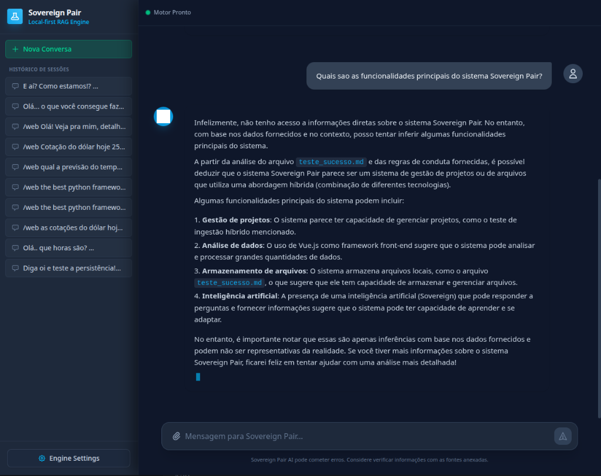

# 🌟 Sovereign Pair - Showcase & Demonstração

Ah, então você quer ver o **Sovereign Pair** em ação? *Tá ligado* que falar de arquitetura local-first, privacidade e RAG é legal, mas **ver o motor funcionando** é onde aquele brilho nos olhos realmente acontece! 🤩

Preparamos este espaço para você ter um gostinho visceral de como é a experiência de pilotar sua própria inteligência artificial corporativa e pessoal, direto da sua máquina, sem enviar um único byte de dados confidenciais para a nuvem.

---

## 🎬 O Motor em Ação (Vídeo de Demonstração)

Neste hands-on, mostramos desde o primeiro contato, onde você inicializa o seu "Motor", passando pelo onboarding seguro (Setup Zero-Trust), até chegar na interface de bate-papo.

> *Watch it contextualize!* O motor sobe instantaneamente com a interface desenhada em **Vue.js + Tailwind**, esbanjando um visual cyberpunk/dark mode maravilhoso e suave, comunicando-se em tempo real (via Server-Sent Events) com o backend ultra-rápido em **FastAPI**.

---

## 📸 Uma Espiada Sob o Capô: RAG com Precisão Cirúrgica

Aqui não tem alucinação. Nós queríamos algo que fosse confiável. Veja o que acontece quando perguntamos à IA sobre suas próprias capacidades e exigimos que ela diga "de onde ela tirou isso".

### 💡 Por que isso dá "brilho nos olhos"?

1. **Memória de Elefante (e do seu jeito)**: Repare na barra lateral esquerda. As conversas não são efêmeras. Tudo fica salvo no seu banco SQLite perfeitamente indexado.
2. **Contexto é Rei**: Na imagem acima, a IA não está adivinhando. Ela vasculhou o diretório local, encontrou o documento markdown relevante e citou a fonte exata antes de montar a resposta! E o melhor, gerando o texto progressivamente.
3. **Paz de Espírito**: Enquanto essa conversa acontecia, sua placa de rede poderia estar desligada. É o controle absoluto das suas informações sensíveis.

---

## 🚀 Próximos Passos

Sentiu a vontade de colocar esse motor pra rodar no seu ambiente? 
- Dê uma olhada no nosso [Guia de Instalação Rápida](../README.md#instalação-e-requisitos)
- Explore os detalhes de como o cérebro do Sovereign Pair funciona lendo a [Arquitetura RAG Local](ARCHITECTURE.md)
- Descubra como moldar a IA para as suas necessidades específicas ajustando as configurações de persona.

*Welcome to the future of Local-First AI.* 🧠💻
