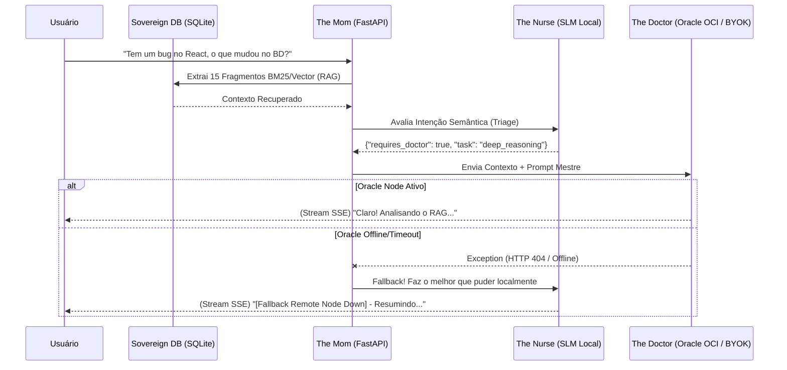

# Masterplan de Interação LLM Cíbrida (Sovereign Fleet)

A arquitetura do **Sovereign Pair** abandonou o conceito isolado de "uma I.A. que faz tudo" e migrou para um **Motor Cíbrido** e fracionado. Nós possuímos ***Papéis Lógicos*** que são orquestrados em ***Máquinas Físicas (Nós)*** distintas.

Abaixo está o mapa de calor de como essas instâncias conversam dinamicamente.

---

## 1. Topologia Física (Os Servidores)

| Nó Físico | Hardware Típico | Responsabilidade Inferencial | Latência |
| :--- | :--- | :--- | :--- |
| **Sovereign Local** | Notebook/PC (Ex: Ryzen) | Frontend, Orquestração RAG e SLMs (Pequenos Modelos). | Ultra-Rápida (< 50ms) |
| **Sovereign Cloud (OCI)** | Oracle Cloud (A1 ARM 24GB) | Modelos Pesados (LLMs >= 8B), Engenharia (Qwen Coder) profunda. | Rápida (< 120ms via Tailscale) |

---

## 2. A Hierarquia Lógica (Os Perfis LLM)

Quando você digita algo na UI, o Sovereign não vomita o texto pro primeiro modelo disponível. Ele passa por uma *Triagem Cognitiva* baseada na classe de complexidade do pedido.

### The Nurse (Enfermeira Triadora)
**Onde Roda Idealmente:** Localmente (SLMs rápidos como *Qwen2.5:0.5b* ou *Llama3.2:1b*)
- **O Papel:** É o porteiro do Cíbrido. Quando a API recebe o `/chat`, The Nurse (Semantic Router) gasta menos de 300 milissegundos validando a intenção do usuário: a pergunta é uma "charada de código profundo" ou só um "resuma esse texto"?
- **Interação:** Se The Nurse perceber que a tarefa é tática e simples (exemplo: extrair entidade ou saudação básica), ela **executa a tarefa sozinha** usando RAM local e encerra a Request. Poupando viagens para a Cloud.

### The Doctor (Especialista Pesado)
**Onde Roda Idealmente:** Oracle Cloud ou Placa de Vídeo Local (LLMs como *Llama3-8b*, *DeepSeek-R1*, *Claude/OpenAI* se BYOK)
- **O Papel:** Se a The Nurse avaliar a `query` e descobrir que você mandou 2.000 linhas de código com um Bug Gástrico no Node.js, ela escala pro Doctor.
- **Interação:** The Doctor é um motor de *Raciocínio Profundo*. Ele recebe o *Contexto Vetorial Pesado* (RAG) empilhado do SQLite-Vec e faz inferência lenta e cautelosa. Se o nó Oracle cair, a API rebaixará graciosamente o pedido de volta The Nurse local informando _"(Raciocínio Profundo Indisponível...)"_.

### The Accountant (Motor AST / Auditor)
**Onde Roda Idealmente:** Local (Exclusivo Python AST Nativo - Não usa LLM)
- **O Papel:** Impede que os LLMs mintam em tabelas ou sofram "alucinação aritmética". Os LLMs são geniais para criatividade, mas podem errar `10.5 * 2`.
- **Interação:** Enquanto *The Doctor* ou *The Nurse* cospe a resposta Markdown, *The Accountant* está ouvindo nos bastidores. Se ele pegar uma expressão `=SUM(A1:B2)`, ele puxa do Python, processa a matemática perfeita em milissegundos, e empurra o valor limpo pro UI.

### The Sentinel (Cyber-Security Guard)
**Onde Roda Idealmente:** Local (YARA Rules + Hashes em Python / ClamAV Docker)
- **O Papel:** Escaneador assíncrono.
- **Interação:** Antes da The Nurse ou do the Doctor lerem qualquer PDF no RAG, o Sentinela veta ou tranca arquivos na Base de Quarentena. Ele não usa LLM intencionalmente para evitar injeções de prompt no motor de segurança.

### The Mom (Orquestradora Mestre RAG)
**Onde Roda Idealmente:** Híbrido.
- **O Papel:** Não é uma persona, mas o `chat_engine` principal (`routes.py`) construído no LlamaIndex. É a "mãe" que gerencia qual filho (LLM Provider) está conectado agora.
- **Interação:** Quando a UI usa comandos ocultos como `/sys`, The Mom desliga o Doctor e o Nurse e sobe o **The Architect** (A RAG do próprio código fonte System), forçando o contexto vetorial do diretório `/system_ingest.py`.

---

## 3. Fluxograma de Roteamento de Inferência

## 4. O Hub de BYOK vs BYOC (Settings)

* **[Bring Your Own Key] (Provedores API):** OpenAI, Groq e Anthropic bypassam as LLMs abertas e entregam a requisição diretamente aos endpoints americanos via `httpx`.
* **[Bring Your Own Compute] (Nós OLLAMA):** Em Configurações > Gerenciar Nós, você adiciona as "Baterias Físicas". Ex: `http://100.116.x.y:11434`. Todo tráfego Docker interno passa a apontar pro Tunel Tailscale ao invés do localhost físico. A I.A fica burra se o nó desconectar e a Nurse assume (Fallback Dinâmico implementado na V0.4.0).
