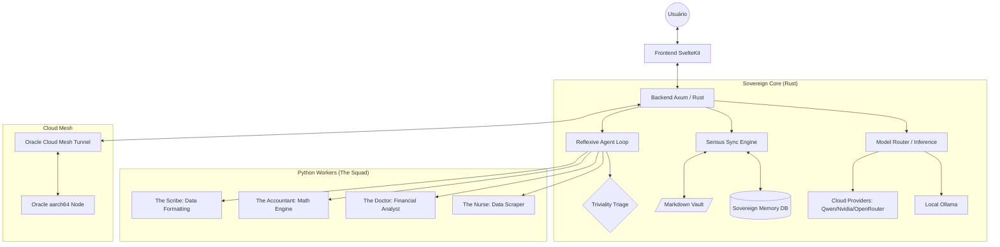
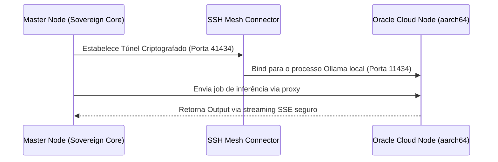

# 🏛️ Sovereign Pair — Engineering Blueprint
## O Livro Aberto da Engenharia Cíbrida

Este documento serve como o manifesto técnico definitivo do Sovereign Pair. Ele detalha "cada parafuso" de nossa engenharia, desde a orquestração de threads em Rust até o pipeline de inferência agêntica.

---

## 1. Visão Geral da Arquitetura (The Cybrid Nexus)

O Sovereign Pair opera sob um modelo **Cíbrido (Cibernético + Híbrido)**. Ele combina a segurança e performance de um núcleo escrito em **Rust** com a flexibilidade matemática, dados e IA do ecossistema em **Python**.

### 1.1 Diagrama de Fluxo Mestre

---

## 2. Componentes de Engenharia Estratégicos

### 2.1 Sensus Sync Engine (The Dual-Truth Persistence)
O **Sensus** é o nosso sistema de persistência dual. Ele garante que o estado do sistema (tarefas, notas, logs, configurações e o Operations Matrix) esteja sempre disponível tanto em um banco de dados relacional (SQLite para queries e performance) quanto em arquivos Markdown legíveis por humanos (Vault para soberania criptográfica e portabilidade).

### 2.2 Reflexive Agentic Loop & Tool Dispatch
Diferente de chatbots lineares, o Sovereign Pair utiliza um loop reflexivo autônomo:
- **Triviality Triage**: Camada de roteamento rápido que impede saudações simples de engatilhar processos pesados.
- **ReWOO (Reasoning Without Observation)**: Planejamento em estágios (Plan & Execute).
- **Tool Dispatching Centralizado**: Roteamento dinâmico para workers Python de finanças e pesquisa sem necessidade de intervenção do Deep Research para queries corriqueiras.

### 2.3 Resilience Shield & Sovereign Telemetry (v1.3.x)
Blindagem de nível de kernel para estabilidade absoluta:
- **OOM Guard (Out-of-Memory)**: Monitoramento de VRAM cross-platform (sysfs no Linux, nvidia-smi em NVIDIA, unified memory proxy para Apple Silicon). Impede crashes do sistema fechando instâncias ou ajustando o contexto preventivamente.
- **API Health Gate**: Gatekeeper de inicialização que registra a integridade (Health Check) das APIs na tabela `api_health_log` e expõe a telemetria via endpoints seguros.

### 2.4 Epistemic Guard & Unified SecOps Vault
Proteção e grounding da integridade de conhecimento:
- **Unified SecOps Vault**: Unificação absoluta do CRUD de chaves (API Keys, SSH/PEM, Certificados, Endpoints). As credenciais são criptografadas em AES-256-GCM (KMS Local) at rest.
- **AI Routing Matrix Override**: O motor lê as credenciais diretamente do SecOps Vault, sobrescrevendo configurações legadas (ex: Qwen, Nvidia, OpenRouter) dinamicamente no `api.rs`.
- **Zero-Trust OCI Gateway**: Conexão nativa do túnel SSH (aarch64) utilizando metadados resolvidos puramente do Vault (incluindo tratamento dinâmico de chaves locais `~/.ssh/id_ed25519` versus chaves raw temporárias).
- **Dynamic Ticker Registry**: Resolução infalível de ativos financeiros locais e globais suportada por um banco integrado (>2.000 tickers).
- **Deep Research Pipeline**: O motor de correlação onde as personas coletam informações externas e The Scribe isola os dados estruturados do "ruído JSON".

### 2.5 Cloud Mesh (Oracle Integration)
Uma malha de infraestrutura elástica offloaded para instâncias aarch64 (Oracle Cloud) sem a necessidade de expor portas na internet. Todo o tráfego de inferência remota é encapsulado via **túnel SSH reverso local** (`localhost:41434 -> oracle:11434`).

---

## 3. Topologia de Rede (OCI Mesh Tunneling)

---

## 4. Hub de Referências Técnicas Avançadas

O ecossistema Sovereign Pair é documentado de forma modular para garantir profundidade técnica:

- **[Arquitetura do Core](core_architecture.md)**: Detalhamento do motor Rust, Sandbox Python e Vision Engine.
- **[Estratégia de Modelos](model_strategy.md)**: Manifesto de Tiers, Aquisição Offline, e Capacidades.
- **[Mecânicas de RAG](rag_mechanics.md)**: Conhecimento Efêmero, Pesquisa Profunda e Grounding.
- **[Segurança & Observabilidade](security_observability.md)**: Blindagem Zero-Trust (KMS) e Telemetry Sinkhole.
- **[Identidade Visual](visual_identity.md)**: Guia estético do Design System "Modern Enterprise".
- **[Integração OpenCode](opencode_integration.md)**: Manual para conexão de IDEs no proxy Sovereign local.

---

## 5. Guia de Manutenção de "Parafusos" do Ciberespaço

Os pilares nativos foram auditados, documentados e compilados com zero warnings, seguindo o padrão ouro do Rust:

- **[`api.rs`](../../core/src/api.rs)**: O hub agêntico que processa as LLMs e reage à Matrix de Configurações dinamicamente.
- **[`sync_engine.rs`](../../core/src/sync_engine.rs)**: O file watcher que executa a "Dupla Verdade" entre banco local e Markdown.
- **[`api_trainer.rs`](../../core/src/api_trainer.rs)**: O sandbox de contenção cross-platform dos Workers Python (The Squad).
- **[`hardware.rs`](../../core/src/hardware.rs)**: Operações de nível de OS para telemetria bruta de VRAM.
- **[`kms.rs`](../../core/src/kms.rs)**: Criptografia de memórias efêmeras via OnceLock para chaves mestras.
- **[`ssh_mesh_connector.rs`](../../core/src/ssh_mesh_connector.rs)**: Construção da rede P2P blindada sem dependência externa.
- **[`state.svelte.ts`](../../svelte-ui/src/lib/state.svelte.ts)**: Reatividade hiper-veloz providenciada pelo Svelte 5.
