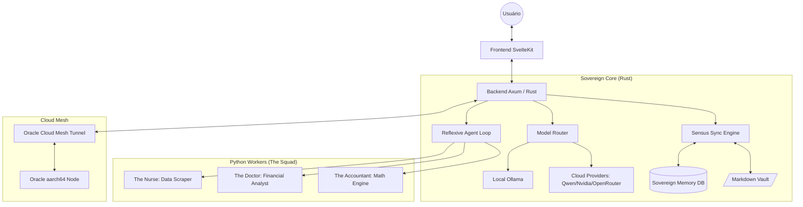
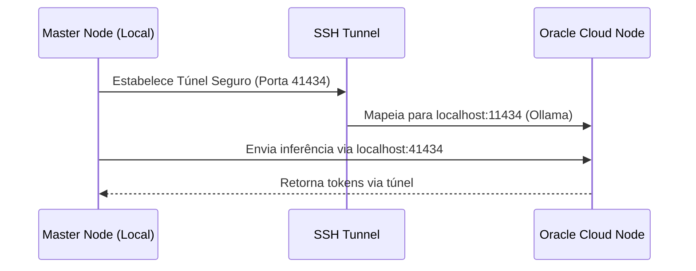

# 🏛️ Sovereign Pair — Engineering Blueprint
## O Livro Aberto da Engenharia Cíbrida

Este documento serve como o manifesto técnico definitivo do Sovereign Pair. Ele detalha "cada parafuso" de nossa engenharia, desde a orquestração de threads em Rust até o pipeline de inferência agêntica.

---

## 1. Visão Geral da Arquitetura (The Cybrid Nexus)

O Sovereign Pair opera sob um modelo **Cíbrido (Cibernético + Híbrido)**. Ele combina a segurança e performance de um núcleo escrito em **Rust** com a flexibilidade do ecossistema de dados e IA em **Python**.

### 1.1 Diagrama de Fluxo Mestre

---

## 2. Componentes de Engenharia

### 2.1 [Sensus Sync Engine](sensus_sync_engine.md)
O **Sensus** é o nosso sistema de persistência dual. Ele garante que o estado do sistema (tarefas, notas, logs) esteja sempre disponível tanto em um banco de dados relacional (SQLite para performance) quanto em arquivos Markdown legíveis por humanos (Vault para soberania e portabilidade).

### 2.2 [Reflexive Agent Loop](agentic_workflows.md)
Diferente de chatbots comuns, o Sovereign Pair utiliza um loop reflexivo baseado em "Pensamentos" e "Ações" (ReWOO, Reflexion, etc).

### 2.3 [Observabilidade & FinOps](observability_llmops.md)
Monitoramento de métricas TTFT/TPS e gestão de custos de inferência via Semantic Caching.

### 2.4 Epistemic Guard (Segurança)
Blindagem de nível de kernel para LLMs:
*   **KMS**: Chaves de API nunca são salvas em texto puro.
*   **Prompt Sanitization**: Proteção contra injeção de prompt e exfiltração de dados sensíveis.
*   **Financial Mechanics**: Metodologia de análise PTAX vs Spot ([Detalhes](financial_mechanics.md)).
*   **OOM Guard**: Telemetria de hardware em tempo real (VRAM/RAM) que ajusta a janela de contexto dinamicamente para evitar crashes.

### 2.5 [Integração OpenCode](opencode_integration.md)
Manual técnico para conexão de extensões de IDE (VS Code/OpenCode) com o Sovereign Proxy local.

---

## 3. Topologia de Rede (OCI Mesh)
Não expomos portas. O túnel SSH reverso cria uma ponte segura entre o hardware local e a nuvem Oracle.

---

## 4. Guia de Manutenção de "Parafusos"

Cada módulo do sistema foi auditado e documentado minunciosamente (Rustdoc/TSDoc):

- **[api.rs](file:///home/jefersonlopes/Developer/local-repositories/sovereign-pair/core/src/api.rs)**: O cérebro do sistema. Gerencia roteamento agêntico, MLA e injeção de contexto RAG.
- **[sync_engine.rs](file:///home/jefersonlopes/Developer/local-repositories/sovereign-pair/core/src/sync_engine.rs)**: Orquestra a "Verdade Dupla" entre SQLite e Markdown via File Watcher resiliente.
- **[api_trainer.rs](file:///home/jefersonlopes/Developer/local-repositories/sovereign-pair/core/src/api_trainer.rs)**: Gestão de Python Workers, Sandboxing e o motor de Deep Research (Fact Verification).
- **[hardware.rs](file:///home/jefersonlopes/Developer/local-repositories/sovereign-pair/core/src/hardware.rs)**: Telemetria de baixo nível (Vulkan/Sysfs) e o guardião anti-OOM.
- **[kms.rs](file:///home/jefersonlopes/Developer/local-repositories/sovereign-pair/core/src/kms.rs)**: Infraestrutura de segurança AES-256-GCM com proteção de memória Zeroize.
- **[ssh_mesh_connector.rs](file:///home/jefersonlopes/Developer/local-repositories/sovereign-pair/core/src/ssh_mesh_connector.rs)**: Tecelagem de túneis SSH para a malha P2P e Nuvem Oracle.
- **[state.svelte.ts](file:///home/jefersonlopes/Developer/local-repositories/sovereign-pair/svelte-ui/src/lib/state.svelte.ts)**: Estado global reativo via Svelte 5 Runes e motor de streaming SSE.
