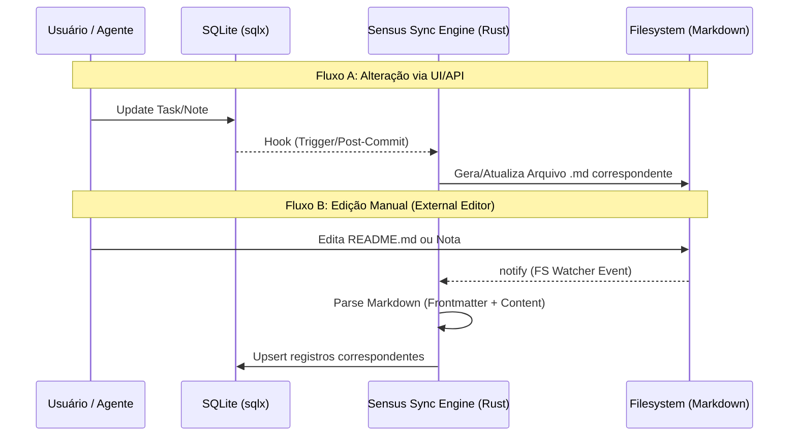

# 🧬 Sensus Sync Engine
## O Coração da Persistência Soberana

O **Sensus Sync Engine** é o mecanismo proprietário do Sovereign Pair que resolve o dilema entre a performance de um banco de dados relacional e a soberania de arquivos de texto puro.

---

## 1. O Fluxo Dual-Truth (Verdade Dupla)

O sistema mantém duas fontes de verdade sincronizadas em tempo real:
1.  **SQLite (`sovereign_memory.db`)**: Utilizado para consultas rápidas, relacionamentos complexos (Kanban) e telemetria.
2.  **Markdown Vault (`/Vault`)**: Arquivos `.md` que contêm o conhecimento humano, notas e documentos de projetos.

### Diagrama de Sincronização

---

## 2. Arquitetura Interna (Rust Core)

O motor é implementado em `core/src/sync_engine.rs` (ou equivalente) utilizando:
*   **Tokio MPSC Channels**: Para enfileirar pedidos de sincronização sem travar a API principal.
*   **Rayon**: Para processamento paralelo de grandes volumes de arquivos Markdown durante o "Cold Boot" (inicialização).
*   **Gray-Matter / Frontmatter Parsing**: Extração de metadados (IDs, Status, Tags) embutidos no topo dos arquivos Markdown.

### Estado de Conflito
Em caso de conflitos de data de modificação:
- **UI ganha**: Se a alteração veio da API, o Markdown é sobrescrito.
- **Timestamp ganha**: Na inicialização, o arquivo mais recente (DB vs FS) dita a verdade.

---

## 3. Benefícios de Engenharia
- **Portabilidade**: Você pode deletar o banco de dados e reconstruí-lo inteiramente a partir do seu `/Vault`.
- **Interoperabilidade**: Use ferramentas como Obsidian, Logseq ou VS Code para editar suas notas; o Sovereign Pair as entenderá instantaneamente.
- **Performance**: Pesquisas complexas de Kanban não precisam ler centenas de arquivos MD; elas usam índices SQL.
