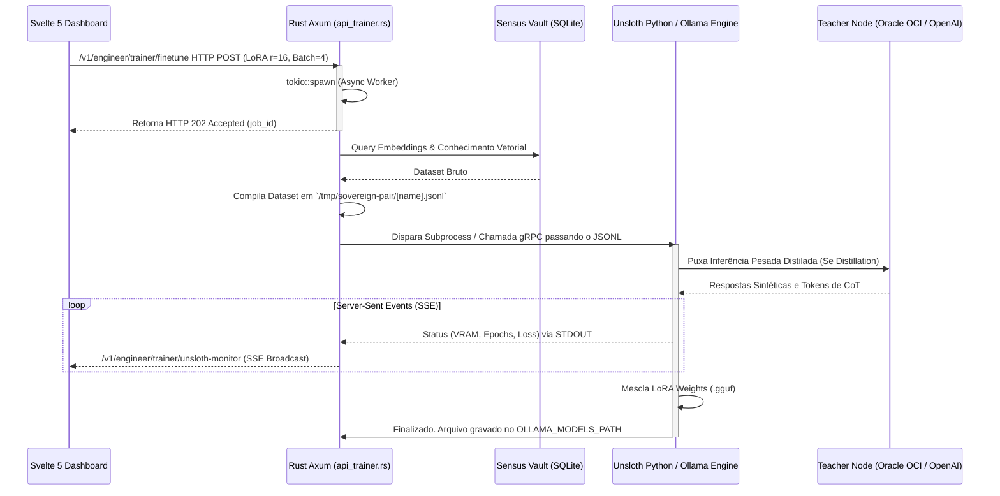

# Sovereign Pair: Arquitetura Híbrida do Model Trainer (Mesh Engine)

## Resumo e Objetivos (Fase 37)

A implementação do **Model Trainer** solidifica o conceito central de *Sovereignty* (Soberania Digital) ao permitir que o usuário refine, destile e audite modelos Locais (Edge) utilizando conhecimento privado (Sensus Vault) e o poder computacional de *Nó de Malha* (Mesh Nodes) da Oracle Cloud e outras APIs proprietárias.

O design abrange três domínios funcionais expostos através do **Svelte 5** nativo:
1. **Knowledge Distillation Studio:** Transferência de conhecimento de Modelos "Professor" maduros (Ex: Nexus-70B Oracle OCI, GPT-4o) para Modelos "Aluno" locais (Ex: Llama 3.2 3B).
2. **Reflection Lab UI:** Ambiente laboratorial que injeta metadados sintéticos de *Chain-of-Thought* e *Self-Correction* para ensinar os modelos locais a aplicar a premissa de *Think-Before-Response*.
3. **Unsloth Fine-Tuning Monitor:** Gerenciador direto para tuning LoRA parametrizável (Batch Size, LoRA Rank, LR).

---

## 🏗️ Topologia e Fluxo de Dados (Data Flow)

O paradigma Híbrido conecta o **Frontend Reativo (Svelte 5)** ao **Proxy de Treinamento (Rust Axum)**, que injeta manifestos gerados sob o flybed unificado do Ollama e dos Workers Python (Unsloth).



---

## 🎨 Design do Frontend (Svelte 5 UI)

Com o lançamento do Svelte 5, nossa base nativa substituiu os blueprints estáticos convertendo todo o fluxo para estados assíncronos vinculados aos Endpoints Axum.

### 1. Distillation Studio (`/distillation/+page.svelte`)
- Utiliza o paradigma de **optgroups** nativos no HTML sobre classes customizadas do Tailwind. 
- Permite auto-discovering de nós: A UI exibe provedores externos lado a lado com *Sovereign Mesh Nodes* disponíveis (ex: Raspberry Pis na mesma rede ZeroTier, Oracle Cloud VMs).
- Integração de *Hyperparameter Constraints*: Controles visuais *Range Slider* de 1 a 10 Epochs interligados nativamente em `$state(3)`.

### 2. Reflection Lab (`/reflection/+page.svelte`)
- Funciona como um depurador em tempo real para os metadados MLOps.
- **Toggles "Think-Before-Response"**: Aplica o comportamento que atrasa a resposta do LLM para forçá-lo a um loop recursivo analítico interno. 
- Componente `JSONL Dataset Preview` com *Highlighting* para checar o formato sintético gerado e alinhar as propriedades de "Auditoria de Lógica".

### 3. Fine-Tuning Engine (`/fine-tuning/+page.svelte`)
- Monitor visual de VRAM gerido em microcomponentes e Barras de Progresso interativas.
- Controles nativos `Unsloth Native Configuration` passando LoRA rank dinamicamente (de `r=8` até `r=128`) para focar em precisão analítica.

---

## ⚙️ Backend Asynchronous Execution (Rust Axum Engine)

O coração da automação vive no ecosistema nativo implementado no `core/src/api_trainer.rs`.

*   **Non-Blocking Jobs (`tokio::spawn`)**: Operações IO massivas, como transformar gigabytes do `Sensus Vault` em um manifesto JSONL, foram acopladas no `tokio::spawn` para prevenir timeout do Client `fetch` original e engasgos na porta `38001`.
*   **SSE Log Bridge Component (`unsloth_monitor_sse_handler`)**: Construindo sob o `async_stream` e canais multithread (`tokio::sync::broadcast`), a arquitetura envia PINGS nulos a cada 10 segundos para contornar bloqueios TCP de roteadores ou firewalls durante inferências extensas que podem durar de horas a semanas (Treinamento Local no Ollama / Python).

### Trechos Chave
A estruturação dos requests agora reflete os parâmetros cruciais definidos semanticamente na camada Svelte:
```rust
pub struct FineTuningReq {
    pub base_model: String,
    pub dataset_name: String,
    pub learning_rate: f64,
    pub lora_rank: i32,
    pub batch_size: i32,
}
```

## 🌏 Autodiscovery dos Nós Soberanos (Mesh)
Uma evolução crítica desta arquitetura foi não depender de nuvens centrais, mas sim do cluster "Mesh" do usuário (Oracle + Edge Device). O Backend tem o poder de rotear e registrar a localização das GPUs espalhadas em redes P2P ou ZeroTier. No caso de Treinos pesados (ex: rodar Llama 70B como "Professor"), a API despacha solicitações REST indiretas que interropem subsegmentos isolados sem drenar bateria e memória do Laptop/Host do Cíbrido e repassa ao Servidor Principal.
