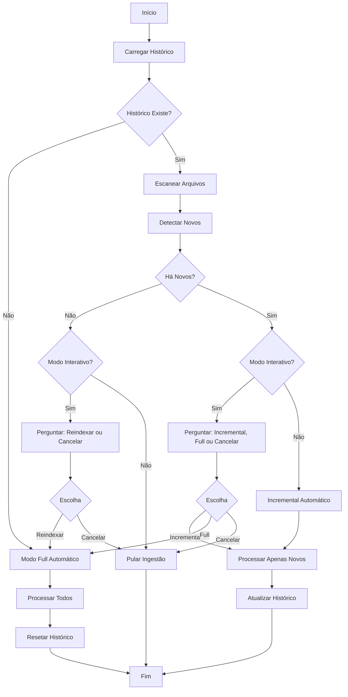

<!-- 
[Aviso Interno de Engenharia]
Este documento 'user_manual.pt-BR.md' é a fusão temporária ('bruta') da base de Fases Anteriores. 
Ele será submetido a um processo de refinamento linguístico focado em maturidade Sênior, erradicação de viés Emoji, reescrita corporativa limpa e posterior paralelização para o idioma en-US.
-->

# Guia do Usuário - Ingestão Incremental

**Versão**: 3.0.0
**Data**: 2026-02-27
**Status**: MVP Completo

---

##  Índice

1. [Introdução](#introdução)
2. [Instalação](#instalação)
3. [Configuração](#configuração)
4. [Interfaces do RAG (Clientes)](#interfaces-do-rag-clientes-v30)
5. [Ingestão (Uso Básico)](#uso-básico)
6. [Ingestão (Uso Avançado)](#uso-avançado)
7. [Troubleshooting](#troubleshooting)
8. [FAQ](#faq)

---

## Introdução

O sistema de **Ingestão Incremental** permite processar apenas arquivos novos ou modificados, economizando tempo e recursos.

### Conceitos Principais

- **Modo Full**: Processa todos os arquivos do zero
- **Modo Incremental**: Processa apenas mudanças (novos, modificados)
- **Hash SHA256**: Detecta modificações de conteúdo
- **ChromaDB**: Armazena embeddings vetoriais
- **Histórico**: Rastreia arquivos processados

### Benefícios

-  **95%+ mais rápido** que reprocessar tudo
-  **Economia de recursos** (CPU, memória, disco)
-  **Detecção precisa** via hash de conteúdo
-  **Limpeza automática** de dados obsoletos

### Nova Funcionalidade: Busca Híbrida (v2.1.0)

O Sovereign Pair agora utiliza **Busca Híbrida**, combinando o melhor de dois mundos:
1. **Busca Vetorial (Semântica)**: Entende o *significado* da sua pergunta (ex: "como configurar o sistema").
2. **Busca por Palavras-Chave (BM25)**: Encontra *termos exatos*, datas e nomes específicos (ex: "erro 404", "2023-10-27", "função x_y_z").

Isso garante que o agente nunca perca um documento importante só porque a busca vetorial não achou a similaridade alta o suficiente.

---

## Instalação

### Requisitos

- Python 3.8+
- pip ou poetry

### Dependências

```bash
pip install llama-index chromadb python-dotenv tqdm colorama
```

### Verificação

```bash
python src/ingest.py --help
```

---

## Configuração

### 1. Arquivo `.env`

Crie `.env` na raiz do projeto:

```bash
# Diretórios
VAULT_DIR=data/vault
RAW_DOCS_DIRS=docs,vault

# ChromaDB
CHROMA_DIR=data/chroma_db
CHROMA_COLLECTION_NAME=documents

# Chunking
CHUNK_SIZE=512
CHUNK_OVERLAP=50

# Modelo
EMBED_MODEL=BAAI/bge-small-en-v1.5
```

### 2. Criar Diretórios

```bash
mkdir -p data/vault data/chroma_db docs
```

### 3. Adicionar Documentos

```bash
# Copiar seus documentos
cp ~/meus-docs/*.md docs/
```

> **Nota**: Para processar arquivos `.docx`, certifique-se de instalar `docx2txt` (`pip install docx2txt` ou via `requirements.txt`).

---

## Uso Básico

### Primeira Execução (Modo Full)

```bash
python src/ingest.py
```

**O que acontece**:
1. Detecta que não há histórico
2. Sugere modo "full"
3. Processa todos os arquivos
4. Cria histórico com hashes SHA256

**Saída esperada**:
```
╔══════════════════════════════════════════════════════════════════╗
║               INGESTÃO INCREMENTAL                               ║
╚══════════════════════════════════════════════════════════════════╝

 Escaneando arquivos...
   Encontrados: 50 arquivos

 RESUMO DE MUDANÇAS
    Novos: 50
     Modificados: 0
     Deletados: 0

 Modo sugerido: full

Escolha o modo [full/incremental/skip/cancel]: full

 MODO FULL: Processando todos os arquivos...
Calculando hashes: 100%|████████████| 50/50 [00:05<00:00, 9.8 arquivo/s]

✓ 50 arquivos processados
✓ 250 chunks criados
✓ Histórico atualizado

======================================================================
 ESTATÍSTICAS DE PROCESSAMENTO
======================================================================

  Tempo total: 1m 30s
 Arquivos processados: 50
 Chunks criados: 250
 Tamanho total: 5.2 MB
 Velocidade: 0.56 arquivos/s
======================================================================
```

### Execuções Subsequentes (Modo Incremental)

```bash
# Modificar um arquivo
echo "\n## Nova seção" >> docs/exemplo.md

# Executar novamente
python src/ingest.py
```

**Saída esperada**:
```
 Verificando 50 arquivo(s) comum(ns)...
Calculando hashes: 100%|████████████| 50/50 [00:01<00:00, 45.2 arquivo/s]

 RESUMO DE MUDANÇAS
    Novos: 0
     Modificados: 1
     Deletados: 0

 Modo sugerido: incremental

Escolha o modo [full/incremental/skip/cancel]: incremental

 MODO INCREMENTAL: Processando mudanças...
    Novos: 0
     Modificados: 1

  Removendo chunks obsoletos...
 Processando apenas arquivos modificados...

✓ 1 arquivo processado
✓ 5 chunks criados

 Modo incremental:
    Novos: 0
     Modificados: 1
     Deletados: 0
     Ignorados: 49
```

---

## Uso Avançado

### Forçar Modo Full

```bash
python src/ingest.py
# Escolher "full" quando perguntado
```

**Quando usar**:
- Após mudanças no modelo de embedding
- Após mudanças no chunk_size
- Para reconstruir do zero

### Validar Estado

```bash
python tests/validate_state.py
```

**Saída**:
```
╔══════════════════════════════════════════════════════════════════╗
║               VALIDAÇÃO DO SISTEMA                               ║
╚══════════════════════════════════════════════════════════════════╝

 VALIDANDO HISTÓRICO
   Versão: 1.1
   Arquivos no histórico: 50
    Todos os 50 arquivos válidos

 VALIDANDO CHROMADB
   Total de chunks: 250
   Arquivos únicos: 50
    ChromaDB válido

 VALIDANDO CONSISTÊNCIA
   Arquivos no histórico: 50
   Arquivos no ChromaDB: 50
    Histórico e ChromaDB consistentes

 RESUMO
   History        :  PASS
   Chromadb       :  PASS
   Consistency    :  PASS

 TODAS AS VALIDAÇÕES PASSARAM
```

### Limpar e Recomeçar

```bash
# Backup (opcional)
cp -r data/chroma_db data/chroma_db.backup
cp data/.ingestion_history.json data/.ingestion_history.json.backup

# Limpar
rm -rf data/chroma_db
rm data/.ingestion_history.json

# Reprocessar
python src/ingest.py
```

---

## Interfaces do RAG (Clientes v3.0)

O **Sovereign Pair** possui três vias exclusivas e reativas para invocar o seu RAG e interagir com seu banco de conhecimento. 

### 1. Web UI (Vue 3)
A aplicação PWA-Ready que você roda via Node. Serve como o painel central do sistema.
- **Temas**: Oculares Dark e Light nativos, persistidos no LocalStorage.
- **Chat Folders**: Você pode organizar suas conversas em pastas diretamente na barra lateral (clicando com o botão direito nos ícones ou usando os botões `Nova Pasta`).
- **Profile Avatar**: A interface usará Avatares Gerados ou seus Emojis biográficos de acordo com as configurações do `Sovereign Context`.

**Como iniciar**:
```bash
python src/cli.py start --web
# Acessar via http://localhost:5173
```

### 2. Plugin Obsidian Nativo
O cérebro do projeto! Construído sob TypeScript, ele injeta-se no meio da sua área de anotações. Você pode usar a tela para falar "Resuma meu arquivo atual", e ele lerá o documento aberto no Obsidian *transparentemente*.

- **Mini-Web**: Fixa a interface RAG completa na aba lateral direita do Obsidian (Sidebar View). 
- **Minimalist**: Esconde a árvore de pastas lateral e foca unicamente na lista e caixa de texto da IA. Perfeito para monitores pequenos.
- **Spotlight Modal**: Uma tela negra central hiperfocada ativável por paleta de comandos do Obsidian, que ofusca todo o editor apenas para o seu Brainstorm com o RAG.

### 3. Agente CLI (Terminal Hacker)
Não quer abrir o navegador nem o Obsidian? Fale com a IA direto do seu `bash/zsh`. O bash herdará todas as suas configurações do perfil e a sua temperatura e se conectará à base vetorial.
- Digite `/v1` ou `/help` no terminal para abrir a lista de comandos.
- Digite `/web {pesquisa}` para fazer o motor buscar resultados no DuckDuckGo direto do console.

**Como iniciar**:
```bash
python src/cli.py chat
```

---

## Troubleshooting

### Problema: "Collection not found"

**Causa**: ChromaDB não inicializado

**Solução**:
```bash
rm -rf data/chroma_db
python src/ingest.py  # modo full
```

### Problema: "Invalid history version"

**Causa**: Histórico de versão antiga

**Solução**: A migração é automática, mas se falhar:
```bash
rm data/.ingestion_history.json
python src/ingest.py  # modo full
```

### Problema: Performance lenta

**Causas e Soluções**:

1. **Muitos arquivos pequenos**
   - Solução: Já otimizado com paralelização

2. **Arquivos muito grandes**
   - Solução: Ajustar CHUNK_SIZE no .env

3. **Disco lento**
   - Solução: Usar SSD ou aumentar max_workers

### Problema: Inconsistência entre histórico e ChromaDB

**Diagnóstico**:
```bash
python tests/validate_state.py
```

**Solução**:
```bash
# Se divergências menores, reprocessar incrementalmente
python src/ingest.py  # modo incremental

# Se divergências grandes, reconstruir
rm -rf data/chroma_db data/.ingestion_history.json
python src/ingest.py  # modo full
```

---

## FAQ

### Como funciona a detecção incremental?

Usa hashes SHA256 do conteúdo dos arquivos. Se o hash mudou, o arquivo foi modificado.

### Por que usar SHA256 e não mtime?

mtime pode mudar sem o conteúdo mudar (ex: `touch`). SHA256 garante detecção baseada em conteúdo real.

### Quanto mais rápido é o modo incremental?

**95%+ mais rápido** quando há poucas mudanças. Exemplo:
- Modo full: 100 arquivos = 2 minutos
- Modo incremental: 2 modificados = 5 segundos

### O que acontece com arquivos deletados?

São detectados automaticamente e seus chunks são removidos do ChromaDB.

### Posso usar com outros modelos de embedding?

Sim! Altere `EMBED_MODEL` no `.env`. Mas precisará reprocessar tudo (modo full).

### Como debugar problemas?

1. Verificar logs no console
2. Executar `python tests/validate_state.py`
3. Verificar `.ingestion_history.json`
4. Verificar ChromaDB com `chromadb.PersistentClient`

### Posso processar múltiplos diretórios?

Sim! Configure `RAW_DOCS_DIRS` no `.env`:
```bash
RAW_DOCS_DIRS=docs,vault,notes,wiki
```

---

## Recursos Adicionais

- [API Documentation](API.md)
- [FAQ Completo](FAQ.md)
- [Testes End-to-End](../tests/manual_e2e_tests.md)
- [CHANGELOG](../CHANGELOG.md)

---

**Autor**: Jeferson Lopes
**Assistência**: Google Gemini 3.
**Data**: 2026-02-27


---

# Guia de Links Simbólicos - Sovereign Pair RAG

Este guia explica como usar links simbólicos (symlinks) para integrar seus documentos existentes sem copiá-los.

---

##  O que são Links Simbólicos?

Links simbólicos são "atalhos" que apontam para arquivos ou diretórios em outros locais do sistema. Eles permitem que você acesse seus documentos originais sem duplicá-los.

**Analogia**: Como um atalho na área de trabalho que aponta para um programa instalado em outro lugar.

---

##  Por que usar Symlinks?

### Vantagens

 **Sem Duplicação**: Não ocupa espaço extra no disco
 **Sempre Atualizado**: Mudanças nos arquivos originais são refletidas automaticamente
 **Organização**: Mantém seus arquivos onde já estão
 **Integração com Obsidian**: Use seu vault diretamente
 **Múltiplas Fontes**: Combine documentos de diferentes locais

### Quando Usar

- Você já tem um Obsidian vault organizado
- Seus documentos estão em múltiplas pastas
- Você não quer duplicar arquivos grandes
- Você quer que mudanças sejam refletidas automaticamente

---

##  Como Criar Links Simbólicos

### Sintaxe Básica

```bash
ln -s /caminho/origem /caminho/destino
```

- `/caminho/origem`: Onde seus arquivos realmente estão
- `/caminho/destino`: Onde você quer que apareçam

### Exemplo 1: Obsidian Vault

```bash
# Seu vault está em ~/Documents/ObsidianVault
# Você quer que apareça em data/vault

cd /caminho/para/sovereign-pair
ln -s ~/Documents/ObsidianVault data/vault
```

**Resultado**: `data/vault` agora aponta para seu Obsidian vault!

### Exemplo 2: Pasta de PDFs

```bash
# Você tem PDFs em ~/Documents/PDFs
# Quer indexá-los sem copiar

cd /caminho/para/sovereign-pair
ln -s ~/Documents/PDFs data/raw_docs/pdfs
```

### Exemplo 3: Múltiplas Pastas

```bash
cd /caminho/para/sovereign-pair

# Criar symlinks para diferentes fontes
ln -s ~/Documents/PDFs data/raw_docs/pdfs
ln -s ~/Downloads/Papers data/raw_docs/papers
ln -s ~/Projects/Documentation data/raw_docs/project_docs
```

**Resultado**: Todos os documentos dessas 3 pastas serão indexados!

---

##  Verificando Links Simbólicos

### Ver se é um Symlink

```bash
ls -la data/vault
```

**Saída**:
```
lrwxrwxrwx 1 user user 35 Feb 16 01:00 vault -> /home/user/Documents/ObsidianVault
```

A seta `->` indica que é um symlink e para onde aponta.

### Verificar se o Symlink está Funcionando

```bash
# Ver conteúdo através do symlink
ls data/vault

# Deve mostrar os mesmos arquivos que:
ls ~/Documents/ObsidianVault
```

---

##  Problemas Comuns

### Symlink Quebrado

**Sintoma**: Link existe mas aponta para local inexistente

```bash
ls -la data/vault
# lrwxrwxrwx ... vault -> /caminho/que/nao/existe (em vermelho)
```

**Solução**:
```bash
# Remover symlink quebrado
rm data/vault

# Criar novo com caminho correto
ln -s /caminho/correto data/vault
```

### Permissões

**Sintoma**: Não consegue ler arquivos através do symlink

**Solução**: Verificar permissões do diretório original
```bash
chmod +r ~/Documents/ObsidianVault/*
```

### Caminho Relativo vs Absoluto

** Evite caminhos relativos**:
```bash
ln -s ../../../Documents/Vault data/vault  # Pode quebrar
```

** Use caminhos absolutos**:
```bash
ln -s ~/Documents/Vault data/vault  # Sempre funciona
# ou
ln -s /home/usuario/Documents/Vault data/vault
```

---

##  Integração com Obsidian

### Passo a Passo

1. **Encontre seu Obsidian Vault**
   ```bash
   # Geralmente está em:
   ~/Documents/Obsidian
   # ou
   ~/Documents/ObsidianVault
   ```

2. **Crie o Symlink**
   ```bash
   cd /caminho/para/sovereign-pair
   ln -s ~/Documents/ObsidianVault data/vault
   ```

3. **Configure o .env** (opcional)
   ```env
   # Ou aponte diretamente no .env
   VAULT_PATH=/home/usuario/Documents/ObsidianVault
   FOLLOW_SYMLINKS=true
   ```

4. **Execute a Ingestão**
   ```bash
   cd src
   python ingest.py
   ```

### Vantagens

-  Todas as suas notas do Obsidian ficam disponíveis para o agente
-  Quando você edita no Obsidian, basta re-indexar
-  Não duplica seus arquivos
-  Mantém sua organização existente

---

##  Alternativa: Caminhos Absolutos

Se você não quer usar symlinks, pode configurar caminhos absolutos no `.env`:

```env
# Apontar diretamente para Obsidian vault
VAULT_PATH=/home/usuario/Documents/ObsidianVault

# Múltiplos caminhos de documentos
RAW_DOCS_PATHS=/home/usuario/Documents/PDFs,/home/usuario/Downloads/Papers

# Seguir symlinks se houver
FOLLOW_SYMLINKS=true
```

**Vantagens**:
- Mais simples (não precisa criar symlinks)
- Configuração centralizada no `.env`

**Desvantagens**:
- Menos flexível que symlinks
- Caminho absoluto pode mudar entre sistemas

---

##  Comparação: Symlinks vs Caminhos Absolutos vs Copiar

| Método | Duplicação | Atualização | Flexibilidade | Complexidade |
|--------|------------|-------------|---------------|--------------|
| **Copiar Arquivos** |  Sim |  Manual |  |  Simples |
| **Symlinks** |  Não |  Automática |  |  Médio |
| **Caminhos Absolutos** |  Não |  Automática |  |  Fácil |

---

##  Dicas e Boas Práticas

### 1. Use Nomes Descritivos

```bash
#  Ruim
ln -s ~/docs data/raw_docs/d

#  Bom
ln -s ~/Documents/PDFs data/raw_docs/pdfs
ln -s ~/Downloads/Papers data/raw_docs/research_papers
```

### 2. Documente seus Symlinks

Crie um arquivo `data/SYMLINKS.txt`:
```
vault -> ~/Documents/ObsidianVault
raw_docs/pdfs -> ~/Documents/PDFs
raw_docs/papers -> ~/Downloads/Papers
```

### 3. Verifique Regularmente

```bash
# Script para verificar symlinks
find data -type l -exec ls -la {} \;
```

### 4. Backup de Configuração

Salve seus comandos de criação de symlinks:
```bash
# Criar arquivo setup_symlinks.sh
cat > setup_symlinks.sh << 'EOF'
#!/bin/bash
ln -s ~/Documents/ObsidianVault data/vault
ln -s ~/Documents/PDFs data/raw_docs/pdfs
ln -s ~/Downloads/Papers data/raw_docs/papers
EOF

chmod +x setup_symlinks.sh
```

---

##  Troubleshooting

### Erro: "Vault path não existe"

**Causa**: Symlink quebrado ou caminho incorreto

**Solução**:
```bash
# Verificar symlink
ls -la data/vault

# Se quebrado, recriar
rm data/vault
ln -s /caminho/correto data/vault
```

### Erro: "FOLLOW_SYMLINKS=false"

**Causa**: Configuração desabilitou symlinks

**Solução**: No `.env`:
```env
FOLLOW_SYMLINKS=true
```

### Nenhum Documento Encontrado

**Causa**: Symlink aponta para pasta vazia

**Solução**:
```bash
# Verificar conteúdo
ls -R data/vault

# Verificar origem
ls -R ~/Documents/ObsidianVault
```

---

##  Exemplos Práticos

### Caso 1: Estudante com Múltiplas Fontes

```bash
# Notas de aula (Obsidian)
ln -s ~/Documents/Obsidian/ClassNotes data/vault

# PDFs de livros
ln -s ~/Books/PDFs data/raw_docs/books

# Papers baixados
ln -s ~/Downloads/Research data/raw_docs/papers

# Slides de aula
ln -s ~/Documents/Slides data/raw_docs/slides
```

### Caso 2: Desenvolvedor com Documentação

```bash
# Notas pessoais
ln -s ~/Notes data/vault

# Documentação de projetos
ln -s ~/Projects/project1/docs data/raw_docs/project1
ln -s ~/Projects/project2/docs data/raw_docs/project2

# READMEs e wikis
ln -s ~/Projects/wikis data/raw_docs/wikis
```

### Caso 3: Pesquisador

```bash
# Vault do Obsidian com anotações
ln -s ~/Obsidian/Research data/vault

# Papers organizados por tema
ln -s ~/Research/Papers/ML data/raw_docs/ml_papers
ln -s ~/Research/Papers/NLP data/raw_docs/nlp_papers

# Datasets e documentação
ln -s ~/Research/Datasets/docs data/raw_docs/dataset_docs
```

---

##  Recursos Adicionais

- [Documentação Completa de Configuração](CONFIGURATION.md)
- [README Principal](../README.md)
- [Documentação do Obsidian](https://obsidian.md)

---

**Dica Final**: Comece simples! Crie um symlink para seu Obsidian vault e veja como funciona. Depois adicione mais conforme necessário.

---

**Autor**: Jeferson Lopes
**Assistência**: Google Gemini 3 e Claude Sonnet 4.5 (Anthropic)
**Data**: 2026-02-27


---

# Guia de Formatos de Arquivo Suportados

Este guia documenta os formatos de arquivo suportados pelo sistema de ingestão do Sovereign Pair RAG.

---

## Suporte a Links Simbólicos (Symlinks)

O sistema suporta **links simbólicos** tanto para **arquivos** quanto para **diretórios**, permitindo organização flexível sem duplicar dados.

### Symlinks de Diretórios

Você pode criar symlinks para diretórios inteiros, e o sistema processará **recursivamente** todo o conteúdo:

```bash
# Linkar Obsidian vault
ln -sf /path/to/obsidian-vault data/vault/my-vault

# Linkar diretório de documentos
ln -sf ~/Documents/Projects/docs data/raw_docs/project-docs

# Linkar múltiplos diretórios
ln -sf ~/Dropbox/Notes data/vault/dropbox
ln -sf ~/Google\ Drive/Docs data/raw_docs/gdrive
```

**Comportamento**:
-  Todo o conteúdo do diretório linkado é indexado recursivamente
-  Subdiretórios dentro do symlink são processados
-  Respeita `ALLOWED_EXTENSIONS` configurado
-  Evita loops infinitos (symlinks circulares)

**Exemplo de log**:
```
 Seguindo symlink de diretório: my-vault -> /home/user/obsidian-vault
   ✓ 45 documento(s) de 'my-vault/'
```

### Symlinks de Arquivos

Você também pode criar symlinks para arquivos individuais:

```bash
# Linkar arquivo específico
ln -sf ~/important-doc.pdf data/raw_docs/doc.pdf

# Linkar múltiplos arquivos
ln -sf ~/thesis.pdf data/raw_docs/
ln -sf ~/notes.md data/vault/
```

**Comportamento**:
-  Arquivo linkado é processado normalmente
-  Respeita extensões permitidas

### Configuração: FOLLOW_SYMLINKS

Controle se symlinks devem ser seguidos via `.env`:

```env
# Seguir symlinks (padrão: true)
FOLLOW_SYMLINKS=true

# Ignorar symlinks
FOLLOW_SYMLINKS=false
```

**Com `FOLLOW_SYMLINKS=false`**:
- Symlinks são ignorados
- Apenas arquivos e diretórios reais são processados
- Log: `  Ignorando symlink 'nome' (FOLLOW_SYMLINKS=false)`

### Detecção de Problemas

O sistema detecta e reporta problemas com symlinks:

**Symlink Quebrado**:
```
 Symlink quebrado 'old-vault': data/vault/old-vault -> /path/nonexistent
```

**Symlink Circular**:
```
  Symlink circular detectado, ignorando: loop
```

### Casos de Uso

#### Obsidian Vault

```bash
# Não copiar vault, apenas linkar
ln -sf ~/Obsidian/MyVault data/vault/obsidian

# Resultado: todas as notas .md são indexadas
```

#### Múltiplas Fontes de Documentos

```bash
# Linkar diferentes fontes
ln -sf ~/Dropbox/Work data/raw_docs/work
ln -sf ~/Google\ Drive/Personal data/raw_docs/personal
ln -sf ~/Documents/Research data/raw_docs/research

# Todas são indexadas juntas
```

#### Documentos Compartilhados

```bash
# Linkar diretório compartilhado na rede
ln -sf /mnt/nas/shared-docs data/raw_docs/shared

# Documentos acessíveis sem duplicação
```

---

## Formatos Suportados Nativamente

O sistema utiliza o `SimpleDirectoryReader` do LlamaIndex, que suporta nativamente os seguintes formatos:

| Formato | Extensão | Descrição | Suporte |
|---------|----------|-----------|---------|
| **Markdown** | `.md` | Arquivos de texto formatado (ideal para Obsidian) |  Nativo + Chunking inteligente |
| **PDF** | `.pdf` | Documentos PDF |  Nativo |
| **Texto** | `.txt` | Arquivos de texto simples |  Nativo |
| **Word (novo)** | `.docx` | Microsoft Word (formato moderno) |  Nativo |
| **CSV** | `.csv` | Planilhas em formato CSV |  Nativo |
| **JSON** | `.json` | Dados estruturados em JSON |  Nativo |
| **HTML** | `.html` | Páginas web |  Nativo |

---

## Chunking Inteligente para Markdown

Arquivos `.md` recebem tratamento especial com o **MarkdownNodeParser**:

### Funcionalidades

-  **Respeita cabeçalhos**: Divide por `##`, `###`, etc.
-  **Preserva blocos de código**: Mantém ` ``` ` intactos
-  **Contexto semântico**: Mantém hierarquia de notas
-  **Ideal para Obsidian**: Estrutura de vault preservada

### Exemplo

```markdown
## Capítulo 1: Introdução

Este é o conteúdo do capítulo 1.

### Seção 1.1

Conteúdo da seção 1.1.

```python
def exemplo():
    return "código preservado"
```

## Capítulo 2: Desenvolvimento

Conteúdo do capítulo 2.
```

**Resultado**: 3 blocos semânticos criados:
1. "Capítulo 1: Introdução" (com conteúdo)
2. "Seção 1.1" (com código preservado)
3. "Capítulo 2: Desenvolvimento"

---

## Formatos NÃO Suportados Nativamente

### Microsoft Word Antigo (.doc)

**Status**:  Não suportado nativamente

**Solução**: Converter para `.docx`

#### Usando LibreOffice (Linux/macOS)

```bash
# Converter um arquivo
libreoffice --headless --convert-to docx arquivo.doc

# Converter múltiplos arquivos
for file in *.doc; do
    libreoffice --headless --convert-to docx "$file"
done
```

#### Usando Microsoft Word

1. Abrir o arquivo `.doc`
2. Arquivo → Salvar Como
3. Escolher formato `.docx`

---

### OpenDocument Text (.odt)

**Status**:  Não suportado nativamente

**Solução**: Converter para `.docx`

#### Usando LibreOffice

```bash
# Converter um arquivo
libreoffice --headless --convert-to docx arquivo.odt

# Converter múltiplos arquivos
for file in *.odt; do
    libreoffice --headless --convert-to docx "$file"
done
```

#### Usando Google Docs

1. Upload do arquivo `.odt` para Google Drive
2. Abrir com Google Docs
3. Arquivo → Download → Microsoft Word (.docx)

---

## Configuração de Extensões

### Arquivo `.env`

```env
# Extensões permitidas (separadas por vírgula)
ALLOWED_EXTENSIONS=.md,.pdf,.txt,.docx
```

### Extensões Padrão

Se não configurado, o sistema usa:
```
.md, .pdf, .txt, .docx, .csv, .json, .html
```

### Personalizando

Para adicionar ou remover formatos:

```env
# Apenas Markdown e PDF
ALLOWED_EXTENSIONS=.md,.pdf

# Todos os formatos suportados
ALLOWED_EXTENSIONS=.md,.pdf,.txt,.docx,.csv,.json,.html

# Adicionar formatos customizados (se tiver readers instalados)
ALLOWED_EXTENSIONS=.md,.pdf,.txt,.docx,.epub
```

---

## Script de Conversão em Lote

Para facilitar a conversão de múltiplos arquivos:

### convert_docs.sh

```bash
#!/bin/bash

# Script para converter .doc e .odt para .docx

echo "Convertendo arquivos .doc para .docx..."
for file in **/*.doc; do
    if [ -f "$file" ]; then
        echo "  Convertendo: $file"
        libreoffice --headless --convert-to docx "$file" --outdir "$(dirname "$file")"
    fi
done

echo ""
echo "Convertendo arquivos .odt para .docx..."
for file in **/*.odt; do
    if [ -f "$file" ]; then
        echo "  Convertendo: $file"
        libreoffice --headless --convert-to docx "$file" --outdir "$(dirname "$file")"
    fi
done

echo ""
echo " Conversão concluída!"
```

**Uso**:
```bash
chmod +x convert_docs.sh
./convert_docs.sh
```

---

## Verificando Formatos nos Seus Documentos

### Listar extensões presentes

```bash
# No diretório de documentos
find data/vault data/raw_docs -type f | sed 's/.*\.//' | sort | uniq -c
```

**Saída exemplo**:
```
  45 md
  12 pdf
   8 txt
   3 docx
   2 doc    #  Precisa conversão
   1 odt    #  Precisa conversão
```

### Encontrar arquivos que precisam conversão

```bash
# Encontrar .doc
find data/vault data/raw_docs -name "*.doc"

# Encontrar .odt
find data/vault data/raw_docs -name "*.odt"
```

---

## Troubleshooting

### Erro: "Nenhum documento encontrado"

**Causa**: Extensões não permitidas ou arquivos em formato não suportado

**Solução**:
1. Verificar `ALLOWED_EXTENSIONS` no `.env`
2. Converter arquivos `.doc`/`.odt` para `.docx`
3. Verificar se há arquivos nos diretórios

### Erro ao processar PDF

**Causa**: PDF pode estar corrompido ou protegido

**Solução**:
1. Abrir PDF em visualizador para verificar
2. Se protegido, remover proteção
3. Recriar PDF se corrompido

### LibreOffice não instalado

**Linux (Ubuntu/Debian)**:
```bash
sudo apt install libreoffice
```

**macOS**:
```bash
brew install --cask libreoffice
```

---

## Estatísticas de Processamento

Durante a ingestão, o sistema mostra:

```
 Etapa 2/4: Processando documentos com chunking inteligente
======================================================================
    Arquivos Markdown: 45
    Outros formatos: 15

    Processando Markdown com MarkdownNodeParser...
      (Respeita cabeçalhos ## e blocos de código ```)
      ✓ 234 blocos semânticos criados

    Processando 15 documentos não-Markdown...
      ✓ 87 blocos criados

    Total de blocos (nodes): 321
    Tamanho médio: 512 caracteres
```

---

## Recomendações

### Para Usuários Obsidian

-  Use `.md` para todas as notas
-  Aproveite o chunking inteligente
-  Mantenha estrutura de cabeçalhos

### Para Documentação Técnica

-  `.md` para documentação versionada
-  `.pdf` para manuais e especificações
-  `.docx` para documentos colaborativos

### Para Pesquisa Acadêmica

-  `.pdf` para papers e artigos
-  `.md` para anotações e resumos
-  `.txt` para transcrições

---

## Recursos Adicionais

- [Documentação LlamaIndex - SimpleDirectoryReader](https://docs.llamaindex.ai/)
- [Guia de Links Simbólicos](SYMLINKS_GUIDE.md)
- [Configuração Completa](CONFIGURATION.md)
- [README Principal](../README.md)

---

**Dica**: Mantenha seus documentos em formatos suportados nativamente para melhor performance e qualidade de indexação!

---

**Autor**: Jeferson Lopes
**Data**: 2026-02-27


---

# Ingestão Incremental

**Status**: MVP (Fase 4 de 5) - Testes End-to-End
**Versão**: 4.0
**Data**: 2026-02-27

---

## Visão Geral

Sistema de ingestão incremental que rastreia arquivos já indexados e processa apenas mudanças, reduzindo drasticamente o tempo de reprocessamento.

### Benefícios

-  **Performance**: 18-36x mais rápido para atualizações
-  **Economia**: Redução de 95%+ no uso de CPU/memória
-  **Rastreabilidade**: Histórico completo de ingestões
-  **Escalabilidade**: Crescimento linear, não quadrático

---

## Como Funciona

### 1. Histórico de Arquivos (v1.1)

Mantém registro em `data/.ingestion_history.json`:

```json
{
  "version": "1.1",
  "last_ingestion": "2026-02-27T16:00:00Z",
  "total_documents": 124,
  "total_chunks": 256,
  "files": {
    "/path/to/doc.md": {
      "indexed_at": "2026-02-27T12:09:41Z",
      "modified_at": 1708095581.0,
      "chunks": 3,
      "content_hash": "sha256:9a5fa520f260ee1240cea..."
    }
  }
}
```

**Novidades v1.1**:
- `content_hash`: SHA256 do conteúdo para detectar modificações
- `modified_at`: Timestamp de modificação do arquivo
- Migração automática de v1.0 → v1.1

### 2. Detecção de Mudanças

Compara arquivos atuais com histórico usando **3 métodos**:

- **Novos**: Arquivos que não estão no histórico
- **Modificados**: Detectados por hash SHA256 do conteúdo
- **Deletados**: Presentes no histórico mas ausentes no filesystem
- **Sem mudança**: Arquivos já indexados com mesmo hash

### 3. Modos de Ingestão

#### Modo Incremental (Padrão)
- Processa apenas arquivos novos e modificados
- Remove chunks obsoletos automaticamente
- Atualiza histórico com novos hashes
- **95%+ mais rápido** que modo full

#### Modo Full
- Reindexar todos os arquivos
- Limpa e recria índice completo
- Reseta histórico
- Útil para troubleshooting

#### Modo Skip
- Apenas limpa arquivos deletados
- Remove chunks do ChromaDB
- Atualiza histórico
- Útil quando não há mudanças

#### Modo Cancel
- Cancela operação
- Nenhuma mudança feita


---

## Funcionalidades (Fase 2)

###  Detecção Completa
1. **Novos Arquivos**: Comparação de paths
2. **Modificações**: Hash SHA256 do conteúdo
3. **Deleções**: Ausência no filesystem
4. **Sem mudanças**: Hash idêntico

###  Limpeza Automática
- Remove chunks obsoletos do ChromaDB
- Remove arquivos deletados do histórico
- Mantém consistência automática

###  Interface Inteligente
- **Modo Interativo**: Mostra resumo e pergunta
- **Modo Automático**: Decide baseado em mudanças
- **4 Modos**: incremental, full, skip, cancel

###  Processamento Otimizado
- Carrega APENAS arquivos modificados
- Atualiza histórico com hashes SHA256
- Economia de 95%+ em recursos

---

## Configuração

### Variáveis de Ambiente

```env
# Arquivo de histórico
HISTORY_FILE=data/.ingestion_history.json

# Modo interativo (pergunta ao usuário)
INTERACTIVE_MODE=true
```

### Modo Não-Interativo

Para CI/CD ou automação:

```bash
export INTERACTIVE_MODE=false
python src/ingest.py
```

Comportamento:
- Se há histórico + novos arquivos → incremental
- Se primeira execução → completa
- Se sem mudanças → pula

---

## Uso

### Primeira Execução

```bash
cd src
python ingest.py
```

**Resultado**:
- Detecta ausência de histórico
- Executa ingestão completa
- Cria `data/.ingestion_history.json`

### Execução com Novos Arquivos

```bash
# Adicionar arquivo
echo "# Novo Doc" > ../data/vault/novo.md

# Executar ingestão
python ingest.py
```

**Interface Interativa**:
```
======================================================================
 RESUMO DE MUDANÇAS
======================================================================

Arquivos já indexados: 124
Arquivos atuais: 125
Novos arquivos detectados: 1

Novos arquivos:
   vault/novo.md

======================================================================
MODO DE INGESTÃO
======================================================================

  [1] Incremental - Indexar apenas novos arquivos (1 arquivo)
  [2] Completa - Reindexar tudo (125 arquivos)
  [3] Cancelar

Escolha (1-3) [padrão: 1]:
```

### Execução Sem Mudanças

```bash
python ingest.py
```

**Resultado**:
- Detecta 0 novos arquivos
- Oferece opção de reindexar ou cancelar

---

## Arquitetura

### Módulos

#### `src/history.py`
Gerenciamento de histórico:
- `IngestionHistory.load()` - Carrega histórico
- `IngestionHistory.save()` - Salva histórico
- `IngestionHistory.get_indexed_files()` - Retorna arquivos indexados
- `IngestionHistory.add_files()` - Adiciona novos arquivos
- `IngestionHistory.clear()` - Limpa histórico

#### `src/diff.py`
Detecção de mudanças:
- `detect_new_files()` - Identifica arquivos novos
- `get_unchanged_files()` - Retorna arquivos sem mudança

#### `src/interactive.py`
Interface com usuário:
- `show_changes_summary()` - Exibe resumo de mudanças
- `prompt_ingestion_mode()` - Pergunta modo de ingestão
- `confirm_action()` - Confirmação genérica

### Fluxo de Execução



---

## Roadmap

###  Fase 1: MVP (Atual)
- Sistema de histórico JSON
- Detecção de novos arquivos
- Interface interativa
- Modo incremental básico

###  Fase 2: Detecção Completa
- Hashing de conteúdo (SHA256)
- Detecção de arquivos modificados
- Detecção de arquivos deletados
- Remoção de chunks obsoletos

###  Fase 3: Robustez
- Validação de integridade
- Recuperação de corrupção
- Backups automáticos
- Comando de rebuild

###  Fase 4: Otimizações
- Cache de hashes
- Processamento paralelo
- Progress bars detalhadas
- Estatísticas de economia

###  Fase 5: Qualidade
- Testes unitários completos
- Testes de integração
- Documentação detalhada
- Exemplos de uso

---

## Métricas

### Cenário Real

**Dataset**: 124 documentos, 256 chunks, 3 minutos

#### Antes (Sem Incremental)
```
Adicionar 1 documento:
- Tempo: 3 minutos (reprocessa tudo)
- Chunks processados: 256 + 3 = 259
```

#### Depois (Com Incremental)
```
Adicionar 1 documento:
- Tempo: 5-10 segundos (apenas novo)
- Chunks processados: 3
- Ganho: 18-36x mais rápido
```

### Economia Mensal

**Uso Diário** (1-2 docs/dia):
- Sem incremental: 90 min/mês
- Com incremental: 8 min/mês
- **Economia: 82 minutos (91%)**

---

## Troubleshooting

### Histórico Corrompido

**Sintoma**: Erro ao carregar histórico

**Solução**:
```bash
rm data/.ingestion_history.json
python src/ingest.py  # Reingestão completa
```

### Dessincronização ChromaDB

**Sintoma**: Histórico diz que arquivo está indexado, mas ChromaDB não tem

**Solução** (Fase 3):
```bash
python src/ingest.py --rebuild  # Futuro
```

**Solução Atual**:
```bash
rm -rf data/chromadb data/.ingestion_history.json
python src/ingest.py
```

### Modo Não-Interativo Não Funciona

**Verificar**:
```bash
echo $INTERACTIVE_MODE  # Deve ser "false"
```

**Corrigir**:
```bash
export INTERACTIVE_MODE=false
python src/ingest.py
```

---

## Limitações Conhecidas (MVP)

1. **Apenas Novos Arquivos**: Não detecta modificações (Fase 2)
2. **Paths Absolutos**: Histórico não portável entre máquinas
3. **Sem Validação**: Não verifica integridade ChromaDB (Fase 3)
4. **Sem Otimizações**: Processamento sequencial (Fase 4)

---

## FAQ

### Por que o histórico usa paths absolutos?

**MVP**: Simplicidade. Paths relativos serão implementados na Fase 2.

### O que acontece se eu deletar o histórico?

Sistema detecta ausência e executa ingestão completa automaticamente.

### Posso forçar reingestão completa?

**Atual**: Escolha opção "2" (Completa) na interface interativa.
**Futuro**: `python src/ingest.py --full`

### O histórico é versionado no Git?

Não. O `.gitignore` protege `data/.ingestion_history.json` pois contém paths absolutos.

---

## Referências

- [Análise Completa](../brain/incremental_ingestion_analysis.md)
- [Plano de Implementação](../brain/incremental_mvp_plan.md)
- [Próximos Passos](../brain/incremental_next_steps.md)

---

**Autor**: Jeferson Lopes
**Assistência**: Claude Sonnet 4.5 (Anthropic)
**Data**: 2026-02-27


---

